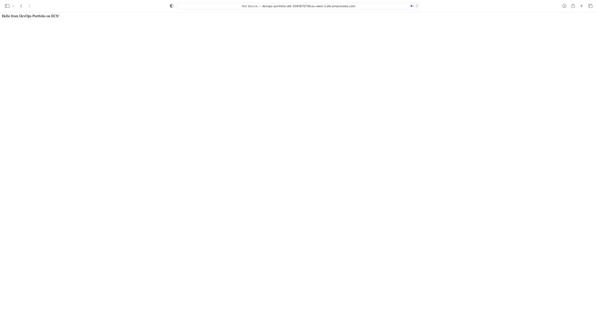
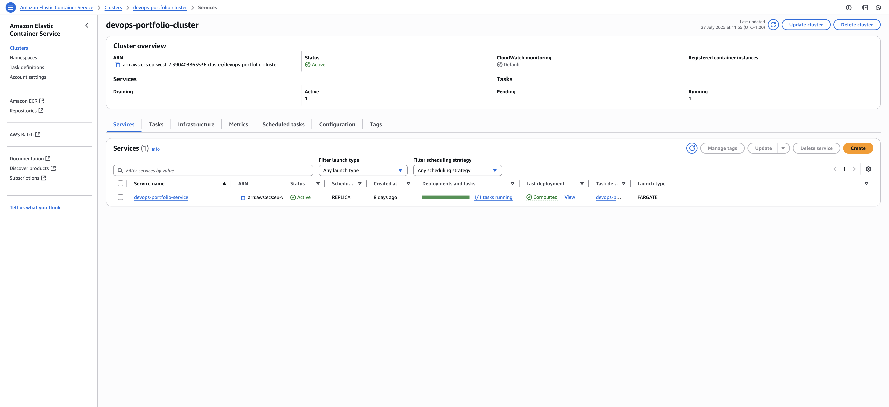
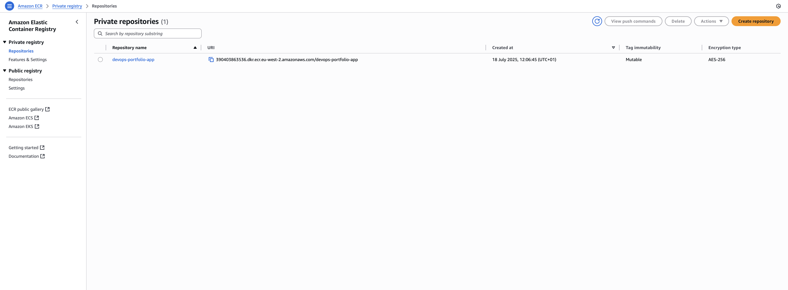
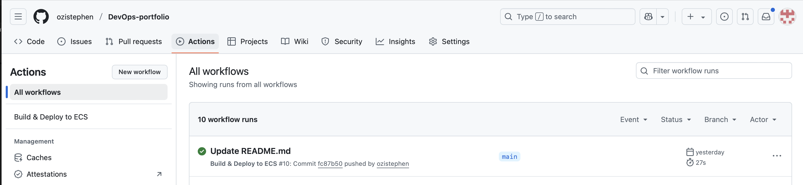

# 🚀 DevOps Portfolio Project – AWS ECS CI/CD Deployment

This project demonstrates end-to-end DevOps skills using Terraform and GitHub Actions to deploy a containerized Node.js application to AWS Fargate via ECS.

## 🔧 What This Project Includes

- **Infrastructure-as-Code** using Terraform
- **CI/CD Pipeline** with GitHub Actions
- **Containerization** with Docker
- **AWS ECS + Fargate** deployment
- **Application Load Balancer (ALB)**
- **ECR** for Docker images
- **IAM Roles** for task/execution
- **CloudWatch Logs**


## 📸 Screenshots

### 🔹 Deployed App in Browser


### 🔹 ECS Cluster & Running Service


### 🔹 ECR Image for Deployment


### 🔹 GitHub Actions CI/CD Pipeline



## 🌍 Live App URL
[http://devops-portfolio-alb-2081870736.eu-west-2.elb.amazonaws.com](http://devops-portfolio-alb-2081870736.eu-west-2.elb.amazonaws.com)

---

## 🛠️ How to Deploy Locally

### Prerequisites:
- AWS CLI configured with access key
- Terraform installed
- Docker
- Node.js

### 🧬 Steps

1. Clone this repo  
2. Navigate to Terraform environment:  
   `cd terraform/environments/dev`

3. Deploy Infrastructure:
   ```bash
   terraform init
   terraform apply
   
4. Push to GitHub to trigger CI/CD pipeline:
   git commit --allow-empty -m "Deploy"
git push origin main

Tech Stack

AWS ECS (Fargate)
ECR
VPC, Subnets, Security Groups
ALB
Terraform
GitHub Actions
Docker
Node.js


Proof of Work > Buzzwords

This repo is built to show recruiters and teams that I can:

Provision and manage AWS infrastructure
Build CI/CD workflows
Containerize and deploy apps
Automate everything


---

### 2. **Push This to GitHub**

Save that content into your `README.md` file in the root of your project.

Then:

```bash
git add README.md
git commit -m "Add recruiter-ready README"
git push origin main
